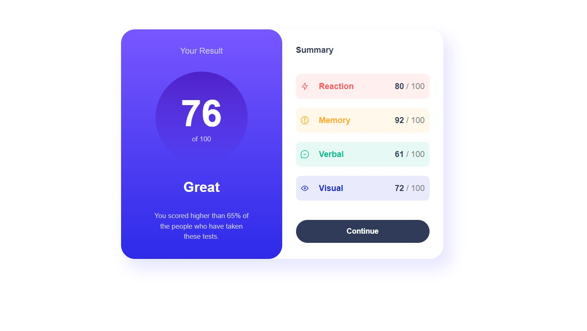

# Frontend Mentor - Results summary component solution

This is a solution to the [Results summary component challenge on Frontend Mentor](https://www.frontendmentor.io/challenges/results-summary-component-CE_K6s0maV). Frontend Mentor challenges help you improve your coding skills by building realistic projects. 

## Table of contents

- [Overview](#overview)
  - [The challenge](#the-challenge)
  - [Screenshot](#screenshot)
  - [Links](#links)
- [My process](#my-process)
  - [Built with](#built-with)
  - [What I learned](#what-i-learned)
  - [Useful resources](#useful-resources)
- [Author](#author)

## Overview

### The challenge

Users should be able to:

- View the optimal layout for the interface depending on their device's screen size
- See hover and focus states for all interactive elements on the page
- Use the local JSON data to dynamically populate the content

### Screenshot

### Links

- Solution URL: [Solution on Frontend Mentor]([https://your-solution-url.com](https://www.frontendmentor.io/solutions/adaptive-page-of-component-using-html-css-and-javascript-CIBNH-L-lE))
- Live Site URL: [Deployed via Vercel](https://results-summary-component-indol-mu.vercel.app/)

## My process

### Built with

- HTML5 markup
- CSS custom properties
- Flexbox
- Mobile-first workflow

### What I learned

This project was created for practicing Pure JS, HTML, CSS.

### Useful resources

- [HTML5 Book](https://html5book.ru) - This resource provides reference data and examples of how to use HTML/CSS
- [MDN Web Docs](https://developer.mozilla.org) - The best resource for front-end developers

## Author

- Website - [GitHub](https://github.com/ostmartin)
- Frontend Mentor - [@ostmartin](https://www.frontendmentor.io/profile/ostmartin)
- LinkedIn - [Arsenii Yermoshkin](https://www.linkedin.com/in/arsenii-yermoshkin-1ba671251/)
